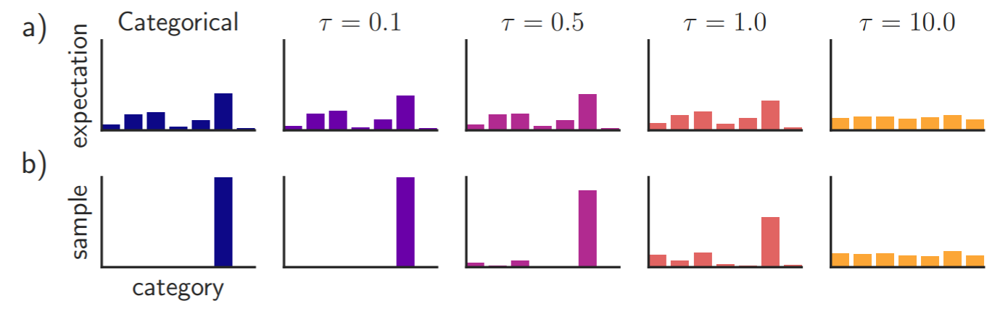

# Differientiable Sampling

## Introduction

**Softmax** is a commonly used function for turning an **unnormalized log probability** into a normalized probability \(or **categorical distribution**\).

$$
\mathbf{\pi} = softmax(\mathbf{o}) = \frac{e^{\mathbf{o}}}{\sum_{j} e^{o_j}},\\o_j \in (-\infty, +\infty)
$$

After softmax, we usually **sample** from this categorical distribution, or taking an $$\arg \max$$ ****function to select the index. However, one can notice that neither the sample nor the $$\arg \max$$ is **differientiable**.

Researchers have proposed several works to make this possible.

## Gumbel Max and Gumbel Softmax [\[1611.01144\]](https://arxiv.org/abs/1611.01144)

I will introduct Gumbel Softmax, which have made the sampling procedure differentiable.


#### Gumbel Max

First, we need to introduce **Gumbel Max**. In short, Gumbel Max is a trick to use gumbel distribution to sample a categorical distribution.

Say we want to sample from a categorical distribution $$\mathbf{\pi}$$. The usual way of doing this is using $$\pi$$ to separate $$[0, 1]$$ into intervals, sampling from a uniform distribution $$U\sim[0, 1]$$, and see where it locates.

The Gumbel Max trick provides an alternative way of doing this.

$$
y = \arg \max_{i} (o_i +g_i)
$$

where $$g_i \sim Gumbel(0, 1) = -\log(-\log(U[0, 1]))$$. We can prove that \(**todo**\) $$y$$ is distributed according to $$\mathbf{\pi}$$.

#### Gumbel Softmax

Notice that there is still an $$\arg \max$$ in Gumbel Max, which makes it indifferentiable. Therefore, we use a softmax function to approximate this $$\arg \max$$ procedure.

$$
\mathbf{y} = \frac{e^{(o_i+g_i) / \tau}}{\sum_{j}e^{(o_j+g_j) / \tau}}
$$

where $$\tau \in (0, \infty)$$ is a temparature hyperparameter.

We note that the output of Gumbel Softmax function here is a vector which sum to 1, which somewhat looks like a one-hot vector \(but it's not\). So by far, this does not actually replace the $$\arg \max$$ function.

To actually get a pure one-hot vector, we need to use a Straight-Through \(ST\) Gumbel Estimator. Let's directly see an [implementation of Gumbel Softmax in PyTorch](https://pytorch.org/docs/stable/nn.functional.html#torch.nn.functional.gumbel_softmax) \(We use the hard mode, soft mode does not get a one-hot vector\).

```python
def gumbel_softmax(logits, tau=1, hard=False, eps=1e-10, dim=-1):
    # type: (Tensor, float, bool, float, int) -> Tensor
    r"""
    Samples from the Gumbel-Softmax distribution (`Link 1`_  `Link 2`_) and optionally discretizes.

    Args:
      logits: `[..., num_features]` unnormalized log probabilities
      tau: non-negative scalar temperature
      hard: if ``True``, the returned samples will be discretized as one-hot vectors,
            but will be differentiated as if it is the soft sample in autograd
      dim (int): A dimension along which softmax will be computed. Default: -1.

    Returns:
      Sampled tensor of same shape as `logits` from the Gumbel-Softmax distribution.
      If ``hard=True``, the returned samples will be one-hot, otherwise they will
      be probability distributions that sum to 1 across `dim`.

    .. note::
      This function is here for legacy reasons, may be removed from nn.Functional in the future.

    .. note::
      The main trick for `hard` is to do  `y_hard - y_soft.detach() + y_soft`

      It achieves two things:
      - makes the output value exactly one-hot
      (since we add then subtract y_soft value)
      - makes the gradient equal to y_soft gradient
      (since we strip all other gradients)

    Examples::
        >>> logits = torch.randn(20, 32)
        >>> # Sample soft categorical using reparametrization trick:
        >>> F.gumbel_softmax(logits, tau=1, hard=False)
        >>> # Sample hard categorical using "Straight-through" trick:
        >>> F.gumbel_softmax(logits, tau=1, hard=True)

    .. _Link 1:
        https://arxiv.org/abs/1611.00712
    .. _Link 2:
        https://arxiv.org/abs/1611.01144
    """
    if eps != 1e-10:
        warnings.warn("`eps` parameter is deprecated and has no effect.")

    gumbels = -torch.empty_like(logits).exponential_().log()  # ~Gumbel(0,1)
    gumbels = (logits + gumbels) / tau  # ~Gumbel(logits,tau)
    y_soft = gumbels.softmax(dim)

    if hard:
        # Straight through.
        index = y_soft.max(dim, keepdim=True)[1]
        y_hard = torch.zeros_like(logits).scatter_(dim, index, 1.0)
        ret = y_hard - y_soft.detach() + y_soft
    else:
        # Reparametrization trick.
        ret = y_soft
    return ret
```

When fowarding, the code use an $$\arg \max$$ to get an actual one-hot vector. And it use `ret = y_hard - y_soft.detach() + y_soft`, `y_hard` has no grad, and by minusing `y_soft.detach()` and adding `y_soft`, it achieves a grad from `y_soft` without modifying the forwarding value.

So eventually, we are able to get a pure one-hot vector in forward pass, and a grad when back propagating, which **makes the sampling procedure differientiable**.

Finally, let's look at how $$\tau$$affects the sampling procedure.




## Reference

* Softmax
* Gumbel Softmax [\[1611.01144\]](https://arxiv.org/abs/1611.01144)
* Concrete Distribution \(Gumbel Softmax Distribution\) [\[1611.00712\]](https://arxiv.org/abs/1611.00712)

Other blogs:

* [https://timvieira.github.io/blog/post/2014/07/31/gumbel-max-trick/](https://timvieira.github.io/blog/post/2014/07/31/gumbel-max-trick/)


